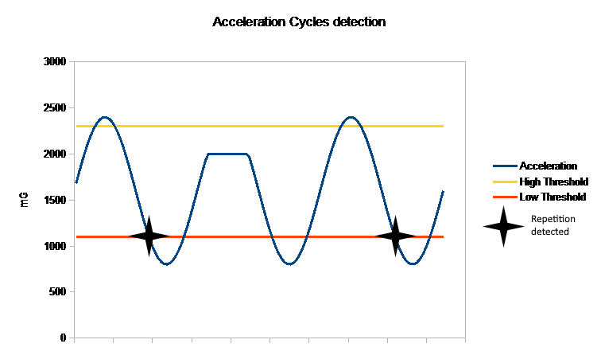

# RepCounter
This repository is an application for Garmin watches. Refer to manifest.xml to know compatible devices.
This application aims to count repetitions of a movement during a workout. This application should be more accurate then the built-in counter. Although this software has been designed to count repetitions of a skipping rope training, it should be able to count repetitions of other movements too.

## How it works
To count the repetitions the application use the acceleration sensor of the device. The technique used is a simple detection of hysteresis cycles. It is a lightweight algorithm and it gives good results. The image below give a good explanation of how it works :

