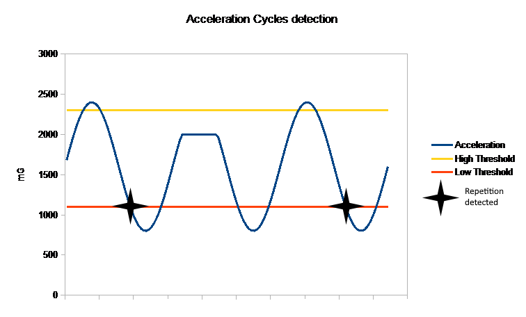

# USER GUIDE : RepCounter 

This applications aims to count repetitions of one single movement. It had been designed for skipping rope but it should work for other movements. The counter rely only on the accelerometer data.

## Calibration

The detection of the repetition rely on an hysteresis. A high acceleration value followed by a low acceleration value must be met to increment the repetition counter. The graph below illustrates it :

The precision of the application depends on the calibration of the two thresholds of the hysteresis. The thresholds(high and low) can be shown and edited in main menu (accessible with a long pressure on up key).

An automatic calibration algorithm is provided in main menu. Choose calibration in main menu to access it. The screen below will be displayed :

On the screen above the user can configure the number of repetitions to do by pressing up or down keys. The default value is 10. When the user presses on the start button he will have to do the number of repetitions he selected in less than 20 seconds. The computation of the thresholds will start when the user presses start again or when the 20 seconds are gone. The application will try several values of thresholds and choose the best. The best setting is the one which detected the closest number of repetitions the user entered. If several settings perform as well then the setting with the biggest spread between the thresholds is chosen. In case of equality the setting with the highest high threshold is chosen.

The different settings tested for calibration can be found in the log of the application(DRIVE:\GARMIN\Apps\LOGS). To enable logs the user has to create the log file manually in the log directory. The name of the log file must be **APP_NAME**.txt where **APP_NAME** is the name of the application.

The calibration can be adjusted if needed. For example if too much repetitions are detected the high threshold value can be increase. If some repetitions are not detected the high threshold value can be decreased. The calibration give a good starting point for the setting of the thresholds but most of the time it has to be adjusted.

## Usage

The main information displayed is the number of repetition detected. The application alternate active phase and rest phase. The user can change the phase by pressing lap key.
One lap contains two phases : the set number is increment every two pressures on the lap key. The **hysteresis state** show the last threshold crossed : if the square is above the line it was a high threshold else it was a low threshold.

The application a emits sound every 50(tunable value) repetitions. Tuning this value to 0 in Sound Counter menu disable this feature.

